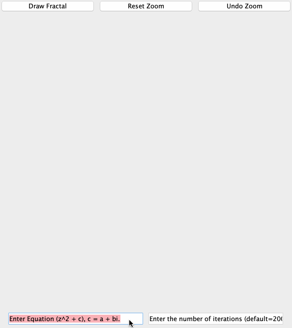

<h1 align="center">Fractal Generator</h1>

    

## About Fractal Generator

     

Fractal-Generator is a small program that allows users to generate fractals (go figure!). The user may enter a complex equation and view the fractal. Not only that, zooming into the fractal is supported as well. There is also a feature to undo a zoom. 

## Dependencies

This program uses my Standards (now Theta) library. The JAR file is included in the /lib/ directory.

## Rebuilding Fractal Generator

Clone the repository to your computer and compile via your favorite IDE or terminal environment. Make sure to add the Standards JAR to the build path.

## Reporting Bugs

See the Issues Tab.

## Version History
The **master** branch encompasses all changes. A version of this which is multi-threaded is present, but does not work correctly (i.e. the performance between the two is negligible).